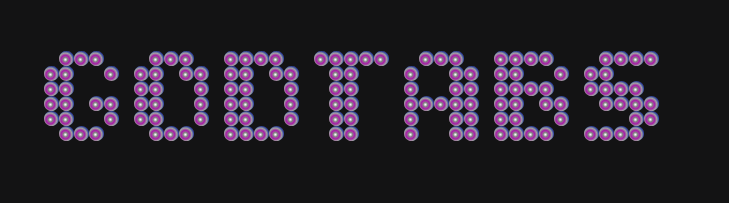

<p align="center">
  
</p>

# GodTabs 🙌

Advanced tab, session, and workspace management Chrome (MV3) extension for power users. Stay organized, recover fast, and tame tab chaos. ✨

## ✨ Features
- 💾 Save & restore sessions and named workspaces
- 🛟 Automatic workspace/tab snapshots (crash recovery)
- 🧹 Duplicate tab detection & bulk close
- 😴 Auto-suspend inactive tabs (discard) with smart exclusions
- 🔍 Fast filtering (pinned / audible / all) & fuzzy search
- ⏱️ Manual + automatic session/workspace backups
- ♻️ Snapshot-based recovery modal

## 🚀 Installation (Local Development Build)
1. Clone or download this repository.
2. (Optional) Install dependencies if you plan to modify CSS build tooling:
   ```bash
   npm install
   ```
3. Build step currently not required (CSS is pre-authored). Tailwind config is present but not yet integrated.
4. Open Chrome and navigate to: `chrome://extensions/`
5. Enable "Developer mode" (toggle in top-right).
6. Click "Load unpacked" and select the repository folder (the one containing `manifest.json`).
7. The extension should appear as **GodTabs**. Pin it for quick access.

## 🧭 Using GodTabs
- Click the extension icon to open the popup dashboard.
- Use search bar to filter by title or URL.
- Filter buttons: All | Pinned | Audible.
- Quick actions include: Close duplicates, Save session, Create workspace, Restore last session, Recovery panel.
- Open the Options page (gear icon) to configure:
  - Auto-save interval & snapshot count
  - Inactive tab suspension rules
  - Workspace/session limits
  - Crash recovery behavior

## ⌨️ Keyboard Shortcuts (Defaults)
| Action | Windows / Linux | macOS |
|--------|------------------|-------|
| Open popup | Ctrl+Shift+T | Command+Shift+T |
| Save session | Ctrl+Shift+S | Command+Shift+S |
| Create workspace | Ctrl+Shift+W | Command+Shift+W |
| Cycle workspaces | Ctrl+Shift+1 | Command+Shift+1 |

(You can adjust these in Chrome: chrome://extensions/shortcuts)

## 🔐 Permissions Explained
| Permission | Purpose |
|------------|---------|
| `tabs` | Enumerate & manage open tabs for sessions/workspaces |
| `sessions` | Access recent closed tabs/windows if extended later |
| `storage` | Persist settings, sessions, workspaces, snapshots |
| `activeTab` | Operate on the currently active tab quickly |
| `notifications` | Show success/warning toasts & recovery notices |
| Content script (`<all_urls>`) | (Future) page metadata & activity signals (currently minimal logging) |

If you prefer stricter privacy, you can temporarily comment out the `content_scripts` block in `manifest.json`—core functionality will continue to work.

## 🗂 Project Structure
```
background.js        # Service worker: core logic (sessions, workspaces, autosave, inactivity)
content/content.js   # (Placeholder) future page intelligence
popup/               # Popup UI (HTML/CSS/JS)
options/             # Options/settings page
scripts/utils.js     # Shared utility namespaces
styles/common.css    # Design tokens + utility classes
manifest.json        # Chrome MV3 manifest
```

## ♻️ Recovery & Auto-Save
The background worker periodically creates lightweight snapshots (tabs + workspaces) respecting user-defined limits. On startup after a crash, it can auto-restore or prompt depending on settings.

## 📤 Export / 📥 Import
Options page allows full data export (JSON) and re-import (overwrites existing). Useful for backup or migration.

## 🛡 Privacy
No analytics, tracking, or external network requests are performed. All data stays in Chrome local/sync storage.

## 🤝 Contributing
1. Fork the repo & create a feature branch.
2. Make changes (consider modularizing `background.js`).
3. Test by reloading unpacked extension.
4. Open a Pull Request with a clear description.

Suggested improvements (open to PRs):
- Split `background.js` into domain modules
- Add tests (Jest/Vitest + Chrome API mocks)
- Integrate Tailwind or remove unused config
- Refine content script scope (`http/https` only)

## ⚠️ Known Limitations
- Large single background file (refactor planned)
- Content script currently passive
- No automated build pipeline yet

## 📄 License
ISC (see `package.json`).

---
Enjoy efficient tab management with GodTabs. Feedback & issues welcome via GitHub Issues. 🚀
